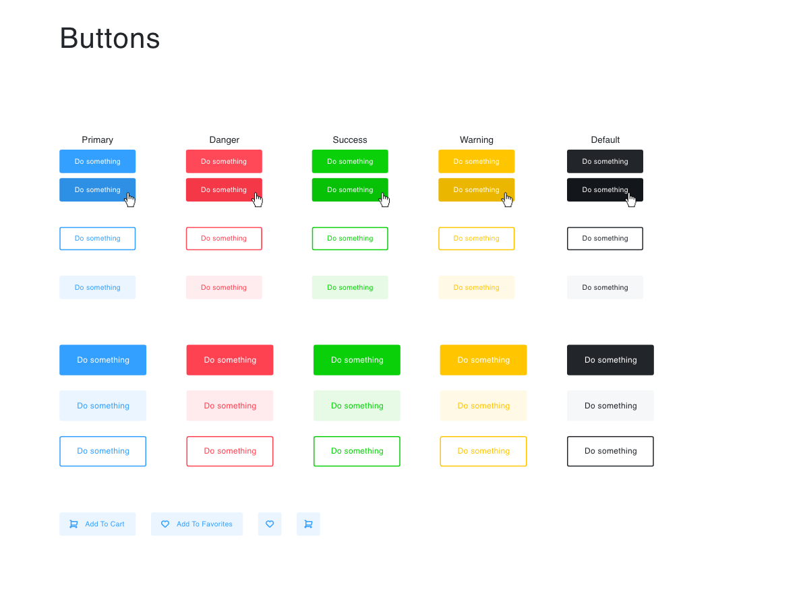
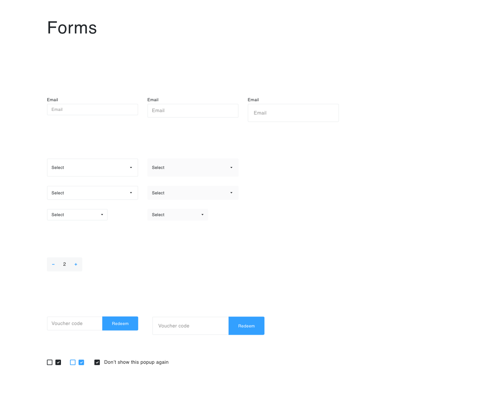

# My First React Storybook
My first React Storybook. I re-created buttons and forms using a design template as a reference; matching the look as close as possible. Doing this project really helped me gain a better understanding of React and how to efficiently use React Components, State, etc. I am looking forward to building more complex storyboards in the future.

# Technologies Used
React

# Authors
Nate Sanchez

# Acknowledgements
General Assembly for providing the design files.
